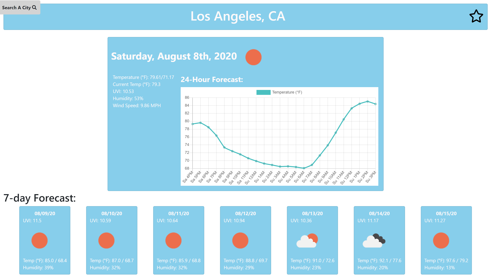
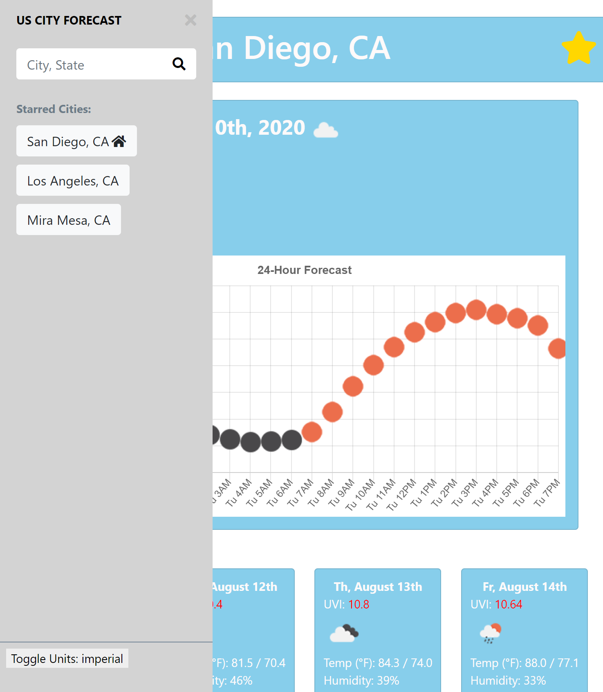
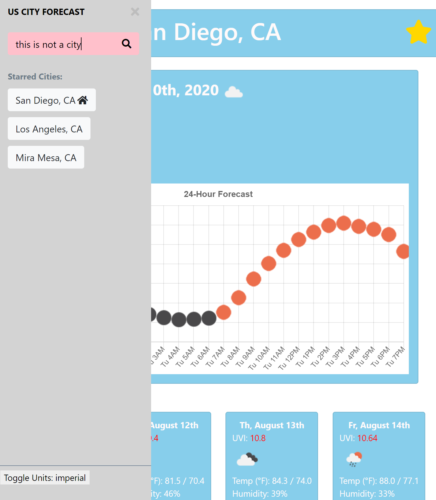

# BCS HW 6: Weather Report!

An HTML site that utilizes JavaScript, openweathermap.org, and Mohamed Azouaoui's sidebar menu to view the weather in US cities.

## Extra Features:
* You can save multiple cities by starring them
* Invalid cities are not searched for, search bar glows red when search is invalid
* Icons have tooltips that display the type of weather in text
* Units are togglable between imerial and metric.

## Access to the HTML

The active URL for this documant is as follows:

https://clydebaron2000.github.io/BCShw6/

Click the link to view the full project via Github Pages.

## Project Preview

## Author

* **Clyde Baron Rapinan** -*Initial work*- https://github.com/clydebaron2000

## Acknowledgments

* UCSD Full Stack Bootcamp for the assignment
* [openweathermap.org](https://openweathermap.org) for their free API data on weather.
* [Mohamed Azouaoui's sidebar menu](https://github.com/azouaoui-med/pro-sidebar-template) 

## License

[GNU](https://choosealicense.com/licenses/gpl-3.0/)
